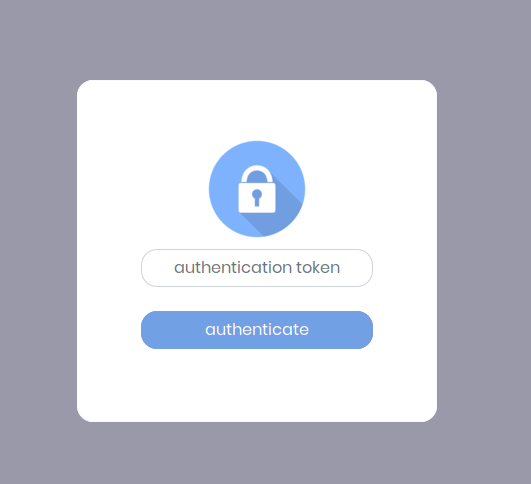

# gen-http-proxy
`gen-http-proxy` is a generic http proxy to an user defined `<host>:<port>` that provides an SSL layer (i.e. https access) and token authentication.

A common use case is to have a `node` application that is being served at `localhost:3000` and you want to have some kind of access control and add https support.

## Usage

Let's suppose that we have a node application serving in `localhost:3000`. That means that it will not accept external connections (because it is bound to `localhost`). And let's assume that our application has not any kind of access control (it can be acceeded anonymously).

Once installed **gen-http-proxy** we can issue the next command:

```console
$ sudo gen-http-proxy :80 localhost:3000
redirecting to localhost:3000
access url: http://0.0.0.0:80?token=bb52dae7c72cf39b33c55586b8dd83d7
token: bb52dae7c72cf39b33c55586b8dd83d7
use cookies: true
expiration: 60
```

And then we will be able to go to a broswer, point to our server (e.g. `http://www.myserver.com`) and we will get a page like this one:



Now you can put the authentication token `bb52dae7c72cf39b33c55586b8dd83d7` in the dialog, and you will be granted the access to the server through the standard http port (i.e. 80).

## Options

The main purpose of **gen-http-proxy** is to serve any request that is made to `<my-server>:<my-port>` by proxying it to `<legacy-server>:<legacy-port>`. 

But **gen-http-proxy** will provide several features:

- **https support**: you can make that the main server supports https while the legacy server does not support it. It is made by simply defining the environment variable `secure=1`. Then you need to provide the path to your certificate and key files in the environment variables `cert=./server.crt` and `key=./server.key`. The legacy server will not be aware of the https layer.

- **token authentication**: you can add a token based authentication to an arbitraty http web page. The default behaviour of **gen-http-proxy** is to generate a random token (and display it in the commandline), but you can customize your token by setting the env variable `token` to your value (e.g. `token=mysecretpassword`). When connecting to the port in which the proxy listens, the token will be expected as GET variable in the URL. Otherwise it will redirect to the `login.html` web page (if the static web server is enabled), or will issue a 401 error.

- **cookie support for authorization**: **gen-http-proxy** expects the token as part of the URL, but most of the web pages will not take care of the existing variables in the current URL. So they will probably remove the `token` variable and the result is that you will not be authorized again. **gen-http-proxy** enables to use cookies for session authentication. Once the authorization is obtanied (because of using the correct token), it will be stored in a cookie that will be retrieved during the session. This behaviour is enabled by default, but you can control it with the env variables `usecookies` and `sessiontimeout`.

- **static web server for unauthorized requests**: **gen-http-proxy** implements a simple static web server that will serve the files stored under a folder. Any request that is not authorized will be redirected to that static web server. It is of special interest to provide a web page that displays the login form. It is enabled by default, but you can control the behaviour using the env variables `staticserver` and `staticfolder`. **gen-http-proxy** provides a simple login form, but you can customize it to (e.g.) show a logo and a message.

## Use cases

### Basic use case

**gen-http-proxy** implements a simple proxy that listens in a port of a server, and forwards the queries to another port in another server.

**example:** listening at any IP address in the host and forward to `localhost:3000` (_have in mind that localhost:3000 would not have external connectivity, but now it hast through port 80_).

```console
$ /usr/local/bin/gen-http-proxy 0.0.0.0:80 localhost:3000
```

### Setting a custom token

**gen-http-proxy** implements an authentication method that is based on a shared token. **gen-http-proxy** generates one random token, but it is possible to set it by including it in the env variable `token`.

In case that the env variable is set to blank (i.e. `token=`), the token authentication will be disabled.

**example:** setting the word "_mysecrettoken_" as access token for the proxy at port 80 to the internal server `localhost:3000`.

```console
$ token=mysecrettoken /usr/local/bin/gen-http-proxy 0.0.0.0:80 localhost:3000
```

### Creating a https server

**gen-http-proxy** is able to listen as an https server. Enabling the SSL layer is controlled by setting the env variable `secure` to `true` or `false`.

In order to implement the https server, it is needed a key and a certificate. You can provide the path to these files in the env variables `key` and `cert`. The default values are `./server.key` and `./server.crt`.

**example:** creating a ssl layer at port 443 (the standard https port) and forward to the non secure `localhost:3000` server.

```console
$ key=/etc/ssl/priv/server.key cert=/etc/ssl/server.crt secure=true /usr/local/bin/gen-http-proxy 0.0.0.0:443 localhost:3000
```

**note:** if you need a self signed certificate, you can execute the following commands:
```console
$ KEYFILE=server.key
$ CERTFILE=server.crt
$ openssl genrsa -out "$KEYFILE"
$ openssl req -new -key "$KEYFILE" -x509 -days 365 -out "$CERTFILE" -subj /CN=$HOSTNAME
```

### Cookies based authentication

Some web pages modify the URL and may remove the `token` variable from the URL. A simple example is a simple link in the legacy web, that will not take into account our `token` variable.

For that cases, **gen-http-proxy** implements a cookie-based authentication. That means that while the cookie is valid, **gen-http-proxy** will consider that the token is stored in the cookie. This mode is activated by default, but it can be controlled by setting the variable `usecookies` to `true` or ``false`.

The validity of the cookie can also be controlled by setting the validity (in seconds) of that cookie in the env variable `sessiontimeout`. If set `sessiontimeout` to `0`, the cookie will only be valid while the session (i.e. while the browser is opened).

**example:** using cookies that will expire after 60 seconds

```console
$ usecookies=true sessiontimeout=60 /usr/local/bin/gen-http-proxy 0.0.0.0:80 localhost:3000
```

### Static web server for unauthorized sessions

**gen-http-proxy** implements a simple web server that will serve pages, images, etc. for unauthorized sessions. This is of special interest for serving a custom login web page, along with the associated resources (images, css, etc.).

The server is controlled by setting the variable `staticserver` to `true` or `false`. The default value is `true`.

The folder that contains the static web page is set in the env variable `staticfolder`. The default folder is `./static`.

**example:** enabling the static web server that will serve files under folder `/var/www/mysite`

```console
$ staticserver=true staticfolder=/var/www/mysite /usr/local/bin/gen-http-proxy 0.0.0.0:80 localhost:3000
```

## The case of theia-ide

**gen-http-proxy** was initially developed to be used in conjunction with [theia-ide](https://theia-ide.org). _Theia-ide_ is a great remote IDE that can be used to develop applications from a web browser. it is capable of creating an application that is _very similar_ to [VS-Code](https://code.visualstudio.com) and allow you to edit the code from your server. The idea is similar to [code9](https://aws.amazon.com/es/cloud9/), [stackblitz](https://stackblitz.com) and others, but using **your own server instead of the cloud vendor's servers**.

The problem of theia-ide is that it does not implement any kind of security. So if you open your code to the internet, anyone can potentially modify it. So **gen-http-proxy** puts a https layer in front of the theia-ide server, along with a token based authentication.

In order to provide a security layer to the theia-ide node application (distributed as a docker container named `theiaide/theia`), you can issue the next commands:

```bash
# This will spawn theia
node /home/theia/src-gen/backend/main.js &

# Now we create the certificates
KEYFILE="/tmp/server.key"
CERTFILE="/tmp/server.crt"
[ ! -e "$KEYFILE" ] && openssl genrsa -out "$KEYFILE"
[ ! -e "$CERTFILE" ] && openssl req -new -key "$KEYFILE" -x509 -days 365 -out "$CERTFILE" -subj /CN=$HOSTNAME

# And start the proxy
cert="$CERTFILE" key="$KEYFILE" secure=$secure /usr/local/bin/gen-http-proxy :10443 localhost:3000
```

Now you could point to the URL https://myserver:10443 and will be able to authenticate using the token in the output.

You can find more information on [secure-theia-ide](https://github.com/dealfonso/secure-theia-ide) in its github repository: https://github.com/dealfonso/secure-theia-ide.